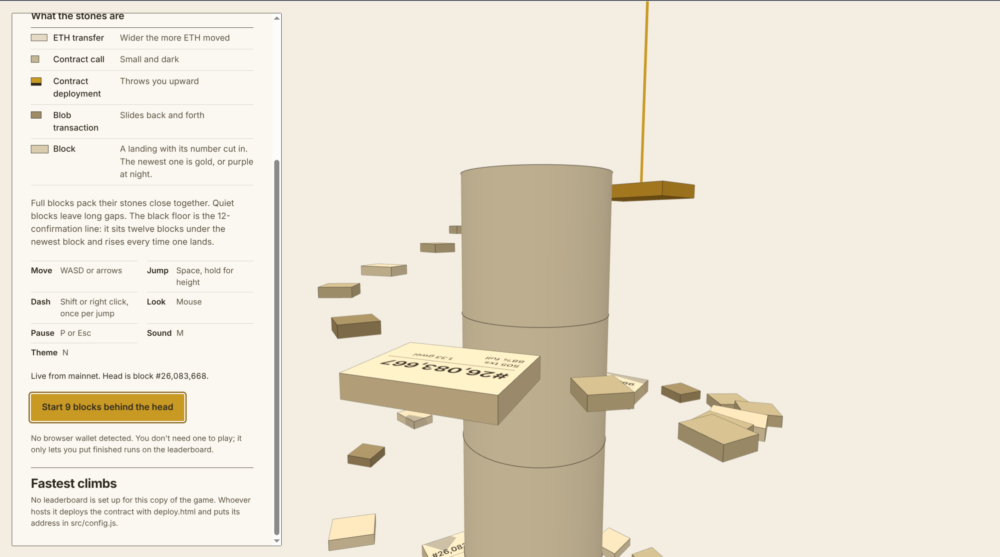
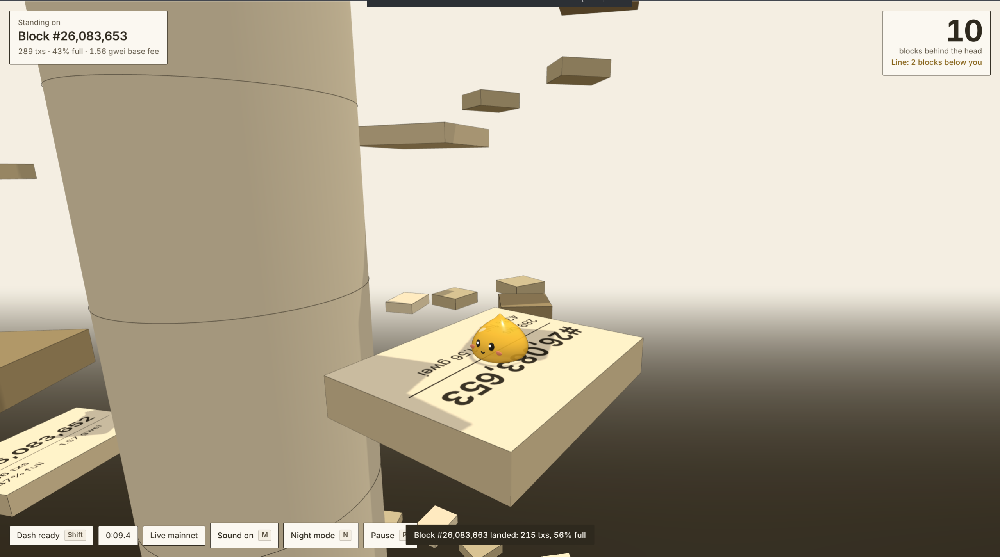
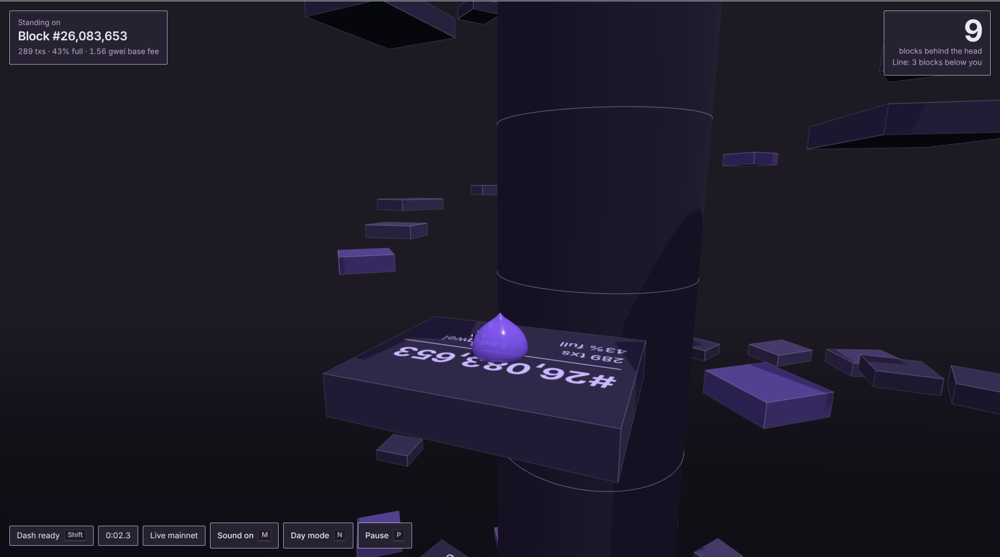

# Unfinalized

A parkour climb up a tower built from live Ethereum mainnet transactions. Every stone you land on is a real transaction, stacked in the order it was included. A new block lands about every 12 seconds, and a black floor rises twelve blocks under the head. You start 9 blocks behind. Reach the newest block before twelve confirmations close over you.

**Play it: [unfinalized.vercel.app](https://unfinalized.vercel.app)**



| Day mode | Night mode |
|---|---|
|  |  |

It runs in the browser with Three.js and no build step.

## The tower

| Stone | Comes from | What it does |
|---|---|---|
| Wide stone | ETH transfer | Wider the more ETH moved |
| Small grey stone | Contract call | A plain foothold |
| Spring | Contract deployment | Throws you upward |
| Sliding stone | Blob transaction (type 3) | Slides back and forth |
| Landing | Block | Has the block number cut in; the newest one is gold, or purple in night mode |

Full blocks pack their stones close together. Quiet blocks leave long gaps, so how hard a stretch is depends on what mainnet was doing at that moment.

## Controls

| Action | Keyboard and mouse | Touch |
|---|---|---|
| Move | WASD or arrows | Left stick |
| Jump | Space, hold for height | Jump button |
| Dash | Shift or right click, once per jump | Dash button |
| Look | Mouse | Drag on the right side |
| Pause | P or Esc | Pause button in the HUD |
| Sound | M | Sound button in the HUD |
| Day / night theme | N | Night mode button in the HUD or title |

The on-screen controls (stick, Jump, Dash and Pause) only appear on touch devices. On a computer you play with the keyboard and mouse.

Pausing doesn't stop the chain. Blocks keep landing and the floor keeps rising.

## Running it locally

The game loads ES modules, so it needs to be served over HTTP. Opening `index.html` from disk won't work. Any static server will do:

```sh
python3 -m http.server 8001
# or
npx serve . -l 8001
```

Then open http://localhost:8001.

Block data comes from public mainnet RPC endpoints (PublicNode, dRPC, 1RPC), tried in turn. If none of them answer, the title screen offers a synthetic chain that generates blocks with the same shape locally. Synthetic block numbers are prefixed with `S` and those runs can't go on the on-chain leaderboard.

## Wallet and leaderboard

Until an on-chain board is deployed (see below), the game keeps a name-based leaderboard in the browser: after catching the head you type your name and the run is saved with its time and block. It lives in `localStorage`, so each browser has its own list.

Connecting a wallet is optional. With one connected, your own mainnet transactions are highlighted in the tower, and a finished run can be submitted to the leaderboard.

The leaderboard is `contracts/UnfinalizedBoard.sol`, deployed on Base Sepolia by default. It keeps each wallet's fastest climb. The game runs in your browser, so the contract can't prove a run happened. What it does check:

- the caught block's timestamp is a real post-merge mainnet slot time
- the run is submitted within 15 minutes of that block
- the climb took at least 15 seconds
- each wallet claims a given mainnet block only once

Every submission logs the caught block's hash, so anyone can check it against mainnet.

### Deploying your own board

`src/config.js` ships with an empty address, so the game uses the in-browser leaderboard until you deploy one:

1. Get some Base Sepolia test ETH from a faucet.
2. Serve the project and open `deploy.html`.
3. Press deploy and approve the transaction. Your wallet is asked to switch networks if it needs to.
4. Paste the line it gives you into `src/config.js`.

To use a different chain, change the `chainId`, `rpc`, and `explorer` fields in `src/config.js`. The compiled contract lives in `src/board-artifact.js` (solc 0.8.28, optimizer on, 200 runs). If you edit the Solidity, recompile and replace that file.

## Files

```
index.html               the game
deploy.html              one-time leaderboard deployment page
style.css
contracts/
  UnfinalizedBoard.sol   leaderboard contract
src/
  main.js                game loop, HUD, menus, run state
  chain.js               mainnet block feed and the synthetic fallback
  course.js              turns blocks and transactions into stones
  player.js              movement, jumping, dashing, collision
  audio.js               synthesized sound effects
  wallet.js              optional browser wallet connection
  board.js               leaderboard reads and writes (viem, loaded on demand)
  board-artifact.js      compiled contract ABI and bytecode
  config.js              leaderboard address and chain
  local-board.js         in-browser leaderboard used when no contract is set
  deploy.js              logic for deploy.html
```

## Dependencies

Loaded from jsDelivr at runtime, nothing to install:

- [three.js](https://threejs.org) 0.169.0 for rendering
- [viem](https://viem.sh) 2.57.0 for the leaderboard, only fetched once the board is used

## License

MIT. See [LICENSE](LICENSE).
